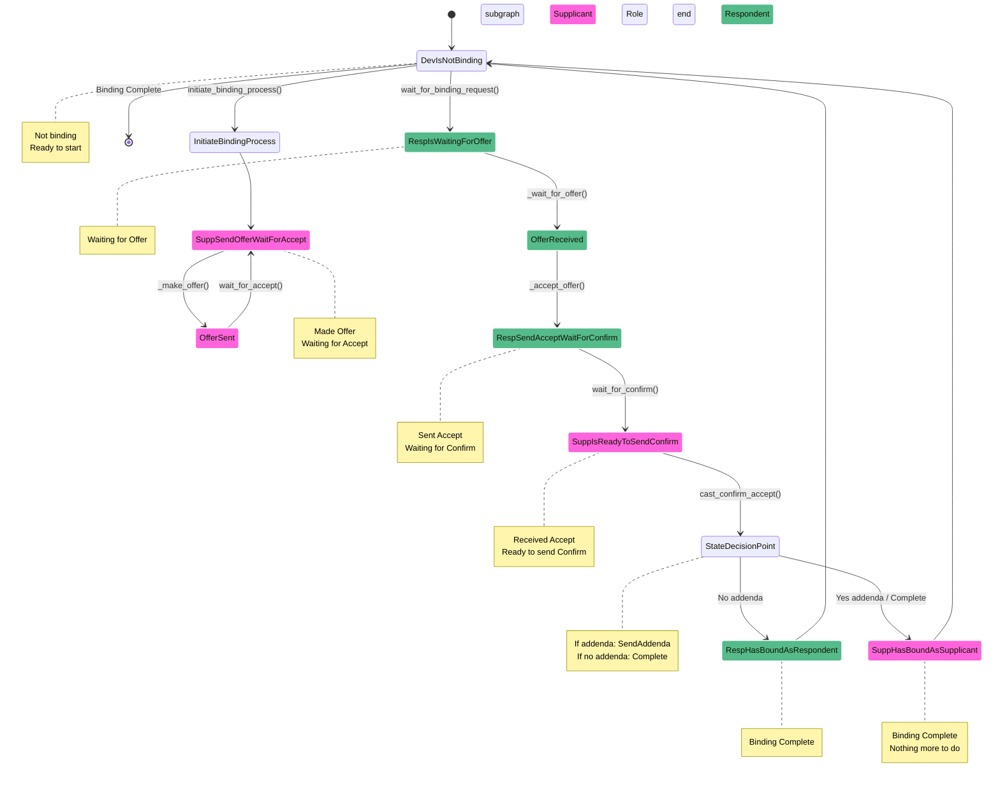

# RAMSES RF Binding Process

## Overview
This diagram shows the binding finite state machine (FSM) for RAMSES RF devices, illustrating the complete process from initial state to binding completion.

## State Machine Diagram



## Method Flow by Role

### Supplicant Flow (Device initiating binding)
```python
async def initiate_binding_process(self, offer_codes, confirm_code=None, ratify_cmd=None):
    1. _make_offer(offer_codes, oem_code)           # Send Offer packet
    2. _wait_for_accept(tender)                     # Wait for Accept response
    3. _confirm_accept(accept, confirm_code)        # Send Confirm packet
    4. _cast_addenda(accept, ratify_cmd)            # Optional: Send Addenda

    # Result: SuppHasBoundAsSupplicant state
```

### Respondent Flow (Device responding to binding)
```python
async def wait_for_binding_request(self, accept_codes, idx="00", require_ratify=False):
    1. _wait_for_offer()                            # Wait for Offer packet
    2. _accept_offer(tender, accept_codes, idx)     # Send Accept packet
    3. _wait_for_confirm(accept)                    # Wait for Confirm packet
    4. _wait_for_addenda(accept)                    # Optional: Wait for Addenda

    # Result: RespHasBoundAsRespondent state
```

## State Details

| State | Role | Description | Key Methods |
|-------|------|-------------|-------------|
| `DevIsNotBinding` | Any | Initial/final state, not participating in binding | - |
| `RespIsWaitingForOffer` | Respondent | Waiting for binding offer from supplicant | `wait_for_offer()` |
| `RespSendAcceptWaitForConfirm` | Respondent | Sent Accept, waiting for Confirm | `cast_accept_offer()`, `wait_for_confirm()` |
| `RespIsWaitingForAddenda` | Respondent | Received Confirm, waiting for optional Addenda | `wait_for_addenda()` |
| `RespHasBoundAsRespondent` | Respondent | Binding completed successfully | ✅ **NEW LOGGING HERE** |
| `SuppSendOfferWaitForAccept` | Supplicant | Sent Offer, waiting for Accept | `cast_offer()`, `wait_for_accept()` |
| `SuppIsReadyToSendConfirm` | Supplicant | Received Accept, ready to send Confirm | `cast_confirm_accept()` |
| `SuppIsReadyToSendAddenda` | Supplicant | Sent Confirm, ready to send Addenda | `cast_addenda()` |
| `SuppHasBoundAsSupplicant` | Supplicant | Binding completed successfully | ✅ **NEW LOGGING HERE** |
| `DevHasFailedBinding` | Any | Binding failed, error state | - |

## Binding Phases (Packet Types)

| Phase | Packet Type | Description | Direction |
|-------|-------------|-------------|-----------|
| `TENDER` | `1FC9` (I_) | Offer phase - initial binding proposal | Supplicant → Respondent |
| `ACCEPT` | `1FC9` (W_) | Accept phase - acceptance of offer | Respondent → Supplicant |
| `AFFIRM` | `1FC9` (I_) | Confirm phase - confirmation of acceptance | Supplicant → Respondent |
| `RATIFY` | `10E0` (I_) | Addenda phase - optional additional binding info | Either direction |

## New Logging Implementation

The following log.info statements have been added at binding completion points:

### 1. Constructor Logging (Immediate Confirmation)
- **`RespHasBoundAsRespondent.__init__()`**: Logs when respondent binding completes
- **`SuppHasBoundAsSupplicant.__init__()`**: Logs when supplicant binding completes

### 2. State Transition Logging (Complete Flow)
- **`BindContextBase.set_state()`**: Logs the complete state transition to bound states, including:
  - Previous state name
  - New bound state name  
  - Final role (respondent/supplicant)

## Example Log Output
```
INFO:ramses_rf.binding_fsm:32:123456: Binding completed as respondent
INFO:ramses_rf.binding_fsm:37:789012: Binding completed as supplicant  
INFO:ramses_rf.binding_fsm:32:123456: Binding process completed: RespSendAcceptWaitForConfirm -> RespHasBoundAsRespondent (role: BindRole.RESPONDENT)
```

## Error Handling
- **Timeout**: Binding fails if expected packets not received within timeout periods
- **Retry Limits**: Automatic failure after retry limits exceeded
- **Exception**: `BindingFlowFailed` raised on binding errors

## Configuration Constants
- `CONFIRM_RETRY_LIMIT`: 3 (automatic binding after this many confirm sends)
- `CONFIRM_TIMEOUT_SECS`: 3 (automatic binding after this many seconds)
- `WAITING_TIMEOUT_SECS`: 5 (fail if no packet received within this time)
